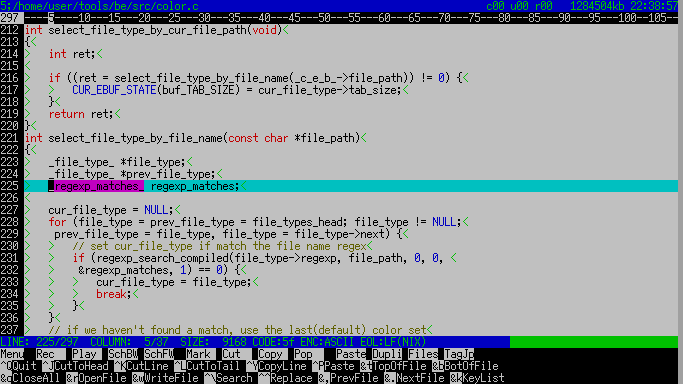
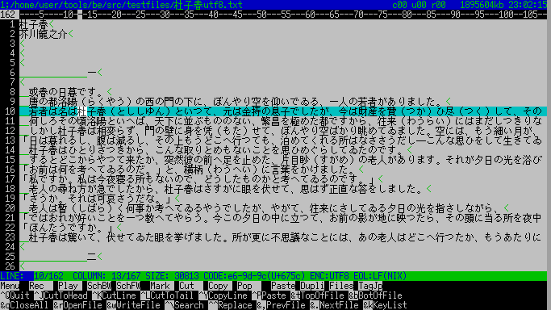
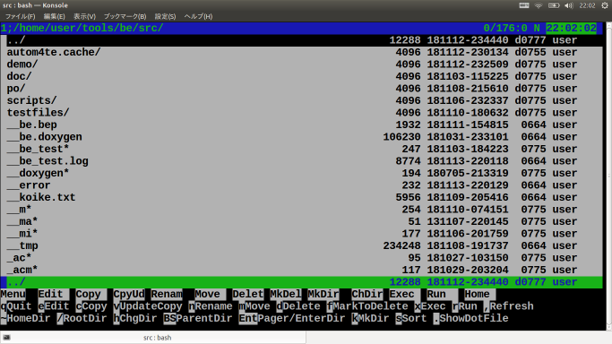
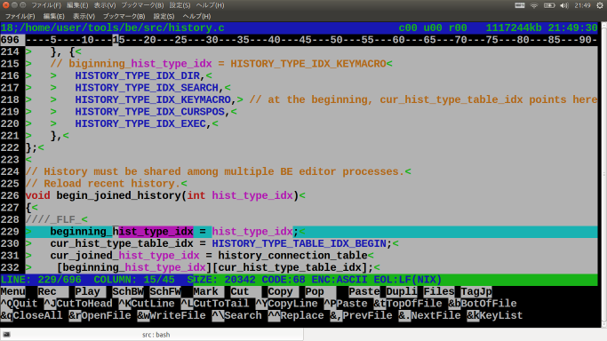
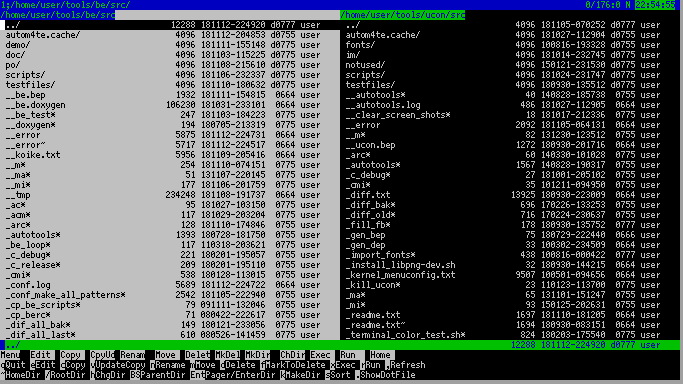
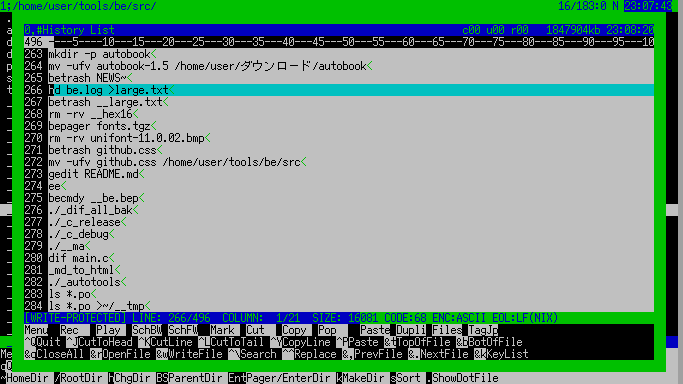
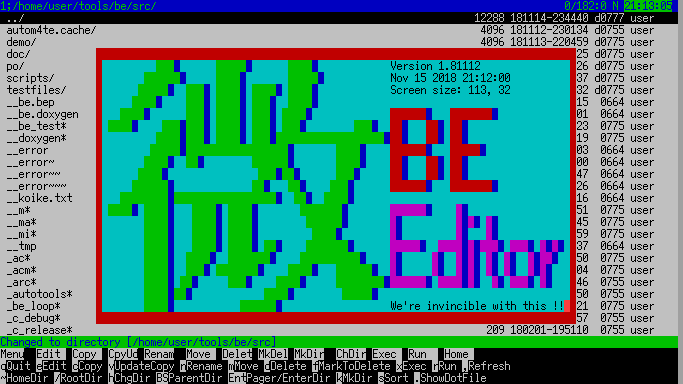

# BE - Small console based Text Editor with Filer.

## Overview
## What is BE editor
- Simple console based (CUI) text editor.
- Based on and forked from GNU NANO editor 1.2.2 (2003).
- Filer (File Manager).

## Description

## Demo(Screen shots)

Editor on Linux frame buffer console with TAB, EOL notation  

--------

Editor editing Kanji text with Wide space notation  

--------

Filer on Konsole  

--------

Editor on Konsole  

--------

Filer in two pane mode on 136 x 38 console  

--------

Filer selecting from execution history  

--------

Splash screen (en)  

## Features
### Text editor
- Multiple buffer. (load multiple files)
- Two panes mode support. (edit different files in each pane)
- Syntax highlighting. (C, C++, asm, ruby, verilog-hdl, vhdl, html)
- Global key word Search and Replace (within multiple files).
- Project file support. (load many files by opening one project file)
- Key bindings are similar to "MIFES" (Japanese DOS based text editor).
  Wordstar like diamond cursor keys (^E ^S ^D ^X).
- Tag Jump. (load file and locate cursor to the position specified by a text line)
- Key Macro. (Record keyboard sequence and reproduce it)
- Regular expression search/replace.
- Japanese character encoding (EUC-JP, S-JIS, JIS, UTF-8) support.
- Three file formats (Line terminator) (LF:UNIX, CR/LF:DOS, CR:MAC) supported.
- Stacked cut buffer.
- Character/Line/Rectangular CUT, COPY and PASTE.
- Backup file is made on saving file.
- Bracket match.
- Undo/Redo.
- History support.  
	Search/Replace history.  
	File position history.  
	Key-macro history.

- Line number, Ruler.
- Tab, EOL(End of Line), Wide-space notation.
- Pull down menu.

### Filer
- Two pane mode support. (good to copy and move files between directories.)
- Similar operation to Japanese DOS based filer "FD" and "FILMTN".
- Copy, delete, move and rename files.
- Make, delete, move and rename directory.
- Execute command.
- History support.  
	Execution history.  
	Current directory history.

- Five histories (Execution/Directory/Search-replace/File-position/Key-macro)
 are seamlessly selectable.

## Usage

### Filer

~~~
$ be [Enter]
~~~
Start Filer.  
Select file by UP and DOWN key and hit 'e' to edit the file.
'd' to detele, 'm' to move and 'c' to copy the file.
'h' to change current working directory.
'q' to quit filer.

### Text editor

~~~
$ be filename1 filename2 [Enter]
~~~
Start Editor loading files.  
You can start editor by passing file(s).
^q to quit editor saving modified text.

### Command line option

    Option       Long option          Meaning
    -C RCFILE    --rcfile=RCFILE      Read RCFILE
    -c           --norcfile           Don't look at berc files
    -h           --nohistory          Don't use history file
    -t NUM       --tabsize=NUM        Set tab-size to NUM[1-15]
    -r           --view               View mode(Read only mode)
    -n           --nonkf              Don't use nkf
    -ea          --encoding=a         ASCII character encoding
    -ej          --encoding=j         JIS character encoding
    -ee          --encoding=e         EUCJP character encoding
    -es          --encoding=s         SJIS character encoding
    -eu          --encoding=u         UTF8 character encoding
    -d           --debug              Output debug log to stderr
    -v           --version            Show version information
    -?           --help               Show this message
    +NUM                              Start at line number NUM

## Naming

In Japanese, BE ("微", pronouced as "bi") means "Micro".
So BE editor is 微 editor, is Small-editor.

## VS.(Feature comparison)
| Name                   | Nano editor | Jed editor | BE editor |
| ----                   | ---- | ---- | ---- |
| Multi-buffer           | Yes | Yes | Yes |
| File browser           | Yes | ??  | Yes |
| Filer (File manager)   | No  | ??  | Yes |
| Syntax highlighting    | Yes | Yes | Yes |
| Undo                   | Yes | Yes | Yes |
| Change key bindings    | No  | Yes | ??  |
| Key-macro              | No  | Yes | Yes |
| Macro language         | No  | S-lang | No  |
| Project file           | No  | No  | Yes |
| UTF-8 support          | Yes | Yes | Yes |
| Binary file editing    | No  | Yes | No  |
| Maximum line length    | Unlimited | Unlimited | 4096 bytes |
| Line number            | Yes | Yes | Yes |
| Ruler (Column number)  | No  | No  | Yes |
| Bracket match          | Yes | ??  | Yes |
| Code folding           | No  | Yes | No  |
| Calling Spell checker  | Yes | No  | No  |
| Drop down menu         | No  | Powerfull | Simple |
| Runs on                | Linux | Linux/Unix/Windows | Linux |
| Mouse operation        | Yes | Yes | No  |
| GUI support            | No  | Yes | No  |
| Binary size            | 200kb | 340kb | 200kb |
| Source code size (lines) | 23000 | 66000 | 22000 |
| Source code size (in KB) | 698kb | 1521kb | 670kb |
| Translation            | en, ja, de, fr, it ... | ?? | en, ja |
| Origin                 | U.S.A | U.S.A | Japan |

## Requirement
### Build and execution requirements:
- Linux OS
- nkf (for Japanese character encoding converter between EUCJP, SJIS and UTF8)

- ncurses/ncursesw
- PCRE (Perl Compatible Regular Expression library)

## Build and execution environments tested:
- Turbo Linux 11 (32 bit)
- Slackware 12.2 (32 bit)
- Ubuntu 12.04 (32 bit)
- Ubuntu 16.04 (32/64 bit)
- Raspbian

## Install
### How to build and install:

Get source tarball "be-x.x.x.tar.gz".  

Extract tarball.

    $ tar xvf be-x.x.x.tar.gz

Enter src directory.

    $ cd be-x.x.x/src

Execute commands.

    $ ./configure
    $ make
    $ sudo make install

## Licence

[GPL](COPYING)

## Author

PCR

## Default Editor key bindings

| Key | Function |
| --- | -------- |
| ^Q | Quit editor |
| ^S | Move Cursor LEFT |
| ^D | Move Cursor RIGHT |
| ^E | Move Cursor UP |
| ^X | Move Cursor DOWN |
| ^A | goto previous word |
| ^F | goto next word |
| ^T | goto top of the line |
| ^B | goto bottom of the line |
| Alt-T | goto top of the file |
| Alt-B | goto bottom of the file |
| ^K | Cut line into cut buffer |
| ^J | Cut to line head |
| ^L | Cut to line tail |
| ^Y | Copy current line into cut buffer |
| ^P | Paste from cut buffer with popinig-up cut buffer |
| ^O | Paste from cut buffer without popinig-up cut buffer |
| ^U | Duplicate current line (^Y and ^P) |

## rc file

| File path   | contents |
| ------------| -------- |
| $PWD/.berc  | 1st candidate of rc-file. |
| $HOME/.berc | 2nd candidate of rc-file. |

## Application direcoty:

| Directory path | contents |
| -------------------- | --------------------|
| $HOME/.be            | 5 history files are saved here. |
| $HOME/.betrash/dirs  | Directories trashed by Filer are moved here. |
| $HOME/.betrash/files | Files trashed by Filer are moved here. |

## Project file

A project file is the file in which all of the files attending to the project are listed.
Files having extension .bep or .pro are recognized as a project file by BE editor.

### How to generate project file

You can easily make project file.

    $ ls *.h *.c *.cpp >my_proj.bep

### How to use Project file

You can load all of the files in your project by passing project file to BE editor like:

    $ be my_proj.bep

Qt project file (Ex. my_proj.pro) can be used as BE project file.

    $ be my_proj.pro

## The largest file size editable

BE editor loads files on memory.
The size of the largest editable file depends on the memory available.
The maximum file size loadable is half the memory available.

## EOF
